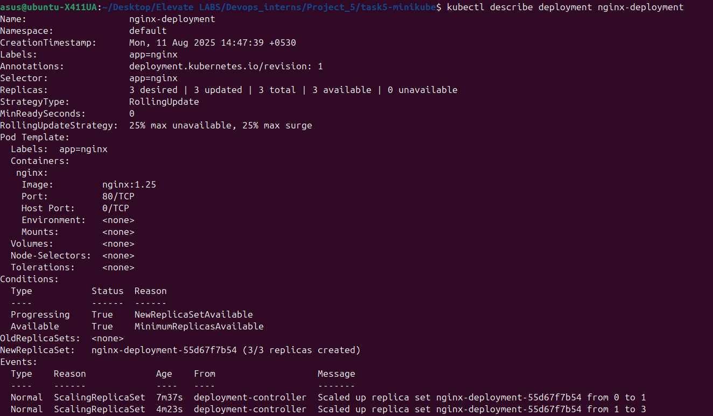
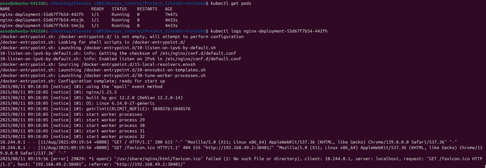
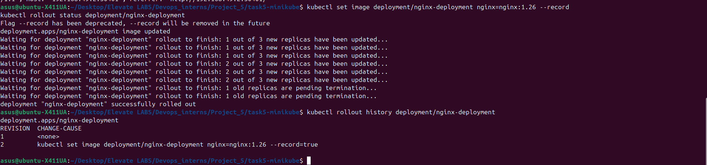
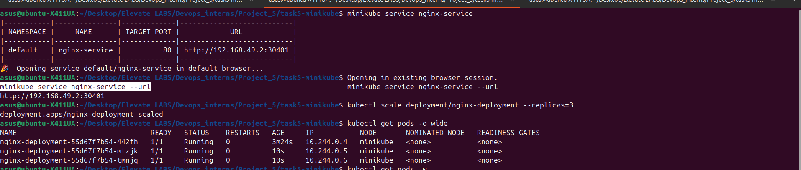
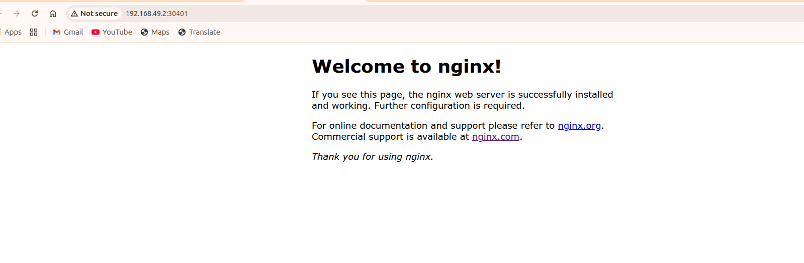

#  DevOps Internship - Task 5  
**Kubernetes Cluster with Minikube**

##  Objective
Deploy and manage applications in Kubernetes locally using Minikube.  
Tasks included:
- Installing & starting Minikube
- Creating Deployment & Service YAMLs
- Exposing application to browser
- Scaling deployments
- Viewing logs & describing resources
- Performing rolling updates

---

## 🛠 Tools & Versions
- **OS:** Ubuntu 25.04  
- **Docker:** 27.5.1  
- **kubectl:** v1.33.3  
- **Minikube:** v1.36.0  
- **Kubernetes Cluster Version:** v1.33.1  
- **Application:** nginx:1.25 → updated to nginx:1.26  

---

## 📂 Project Structure
```
task5-minikube/
├── deployment.yaml # Kubernetes Deployment manifest for Nginx
├── service.yaml # Kubernetes Service manifest (NodePort)
├── README.md # Project documentation & steps
└── screenshot/ # Folder containing all task screenshots
```
---

###  Steps Performed

### 1️⃣ Install kubectl
```
curl -LO "https://dl.k8s.io/release/$(curl -L -s https://dl.k8s.io/release/stable.txt)/bin/linux/amd64/kubectl"
sudo install -o root -g root -m 0755 kubectl /usr/local/bin/kubectl
kubectl version --client

### 2️⃣ Install Minikube

curl -Lo minikube "https://storage.googleapis.com/minikube/releases/latest/minikube-linux-amd64"
sudo install minikube /usr/local/bin/minikube
minikube version

### 3️⃣ Start Minikube

minikube start --driver=docker --memory=4096 --cpus=2
kubectl get nodes

### 4️⃣ Create Deployment

apiVersion: apps/v1
kind: Deployment
metadata:
  name: nginx-deployment
  labels:
    app: nginx
spec:
  replicas: 1
  selector:
    matchLabels:
      app: nginx
  template:
    metadata:
      labels:
        app: nginx
    spec:
      containers:
      - name: nginx
        image: nginx:1.25
        ports:
        - containerPort: 80

### 5️⃣ Create Service

apiVersion: v1
kind: Service
metadata:
  name: nginx-service
spec:
  type: NodePort
  selector:
    app: nginx
  ports:
  - protocol: TCP
    port: 80
    targetPort: 80

### 6️⃣ Apply Deployment & Service

kubectl apply -f deployment.yaml
kubectl apply -f service.yaml
kubectl get pods -o wide
kubectl get svc

### 7️⃣ Access Application
minikube service nginx-service
# OR get URL
minikube service nginx-service --url

### 8️⃣ Scale Deployment
kubectl scale deployment/nginx-deployment --replicas=3
kubectl get pods -o wide

### 9️⃣ Describe Resources
kubectl describe deployment nginx-deployment
kubectl describe pod <pod-name>

### 🔟 View Logs
kubectl logs <pod-name>

### 1️⃣1️⃣ Rolling Update
kubectl set image deployment/nginx-deployment nginx=nginx:1.26 --record
kubectl rollout status deployment/nginx-deployment
kubectl rollout history deployment/nginx-deployment

```
### 📸 Screenshots

1. **Minikube Node Status**  
   

2. **Pods Status Before Scaling**  
   

3. **Pods Status After Scaling**  
   

4. **Nginx Welcome Page in Browser**  
   

5. **Rolling Update Output**  
   
